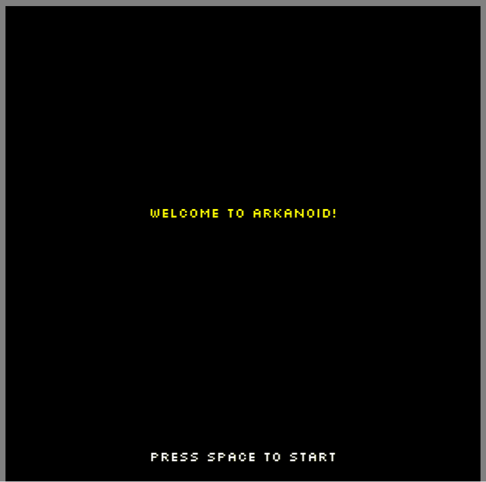

# ArkanoidGame

A simple Arkanoid-style game built with **C++**, **SDL3**, and **CMake**.

<p align="center">
  
</p>

## 🚀 Features

- 2D Arkanoid-style gameplay with block destruction
- SDL3-based windowing, rendering, input, and audio
- Simple physics with **Continuous Collision Detection (CCD)**  
- Basic **particle system** for visual effects (e.g. block destruction)  

---

## 🕹️ How to Play


Use the platform to bounce the ball and destroy all blocks. Don’t let the ball fall!

| Key           | Action                                             |
|----------------|----------------------------------------------------|
| `← / →` Arrows | Move platform left/right                          |
| `SPACE`        | Universal action (Start / Launch / Pause / Resume) |
| `R`            | Reset game                                        |
| `Esc`          | Exit game                                         |


---

## 🧰 Dependencies

- [SDL3](https://github.com/libsdl-org/SDL)
- [SDL3_ttf](https://github.com/libsdl-org/SDL_ttf)

Both dependencies are included under `third_party/`.

---

## 🛠️ Build Instructions (Windows)

### Prerequisites

- CMake 3.15+
- C++20-compatible compiler
- Git

### Clone the repository

```bash
git clone https://github.com/karel-tomanec/ArkanoidGame.git
cd ArkanoidGame
```

### Update submodules
```bash
git submodule update --init --recursive
```

### Build with CMake
```bash
mkdir build
cd build
cmake ..
cmake --build . --config Release
```

### Run the game
After building, launch the game executable located at `ArkanoidGame/build/bin/Release/Arkanoid.exe`.
